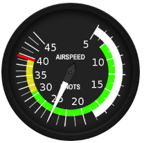

#flightpanel-speed

Re-usable Speed indicator Custom Element refactored from
[flightSimPanels](https://github.com/dmolin/flightSimPanels)
using Polymer library with Web Component.

`<flightpanel-speed id="si2speed" width=200 height=200 speed=25></flightpanel-speed>`

  

The Speed indicator is scaled to the top speed 49 kts of SolarImpulse2.
Its native resolution and default width & height are 300 px.

The Custom Element accepts attributes `width`, `height` (in px), and `speed` (in kts).
It watches `speed`, and adjusts the hand as it changes.
See example in [index.html](index.html) .

This Custom Element is derived from Polymer's
[seed-element](https://github.com/PolymerLabs/seed-element)
according to
"Create a reusable element: Publish reusable Polymer elements on GitHub"
https://www.polymer-project.org/1.0/docs/start/reusableelements.html .
